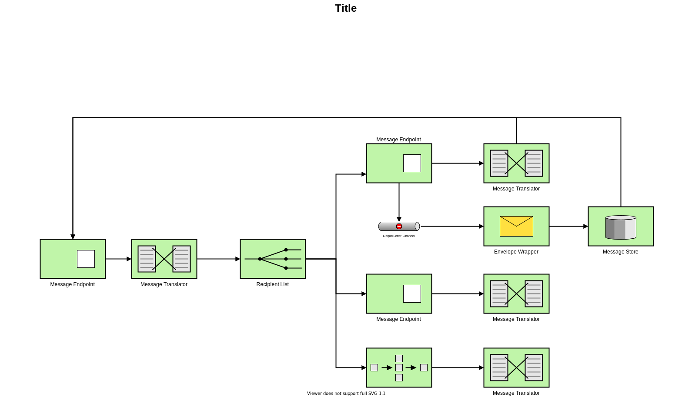

#  Toronto Tech Mentoring
<!-- ALL-CONTRIBUTORS-BADGE:START - Do not remove or modify this section -->

<!-- ALL-CONTRIBUTORS-BADGE:END -->
 

## Overview

Born out of [CivicTechTO](http://civictech.ca/), Toronto Tech Mentoring is a volunteer run organisation aimed at supporting youth in the Greater Toronto Area through mentorship and education in technology and coding. Due to the success of the not for profit program and the desire to scale to accomodate this rising interest, a website is being developed to provide information for volunteers, clients and partners.

 
The website is being developed by volunteers sharing a passion to teach one another and develop sharper coding skills in web development and React.

 

## :construction: Architecture

## Contributions

If you would like to get involved with the project reach out to hello@acceleratorproject.xyz or join attend one of the CivicTechTO meetup sessions every tuesday night [here](https://www.meetup.com/Civic-Tech-Toronto/)

### 💜 Check out our Github WIKI here: https://github.com/Toronto-Tech-Mentoring/TTM-Gatsby/wiki
 

***

## Contributors ✨

Thanks goes to these wonderful people ([emoji key](https://allcontributors.org/docs/en/emoji-key)):

<!-- ALL-CONTRIBUTORS-LIST:START - Do not remove or modify this section -->
<!-- prettier-ignore-start -->
<!-- markdownlint-disable -->
<!-- markdownlint-restore -->
<!-- prettier-ignore-end -->
<!-- ALL-CONTRIBUTORS-LIST:END -->

This project follows the [all-contributors](https://github.com/all-contributors/all-contributors) specification. Contributions of any kind welcome!